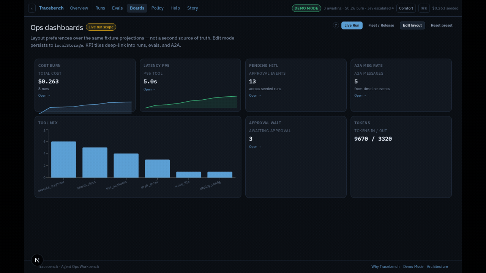

# Tracebench

**Agent Ops Workbench** — a HITL control room for AI agents.  
Senior FE portfolio showpiece for **Dominik Pawlikowski**.



> **Demo Mode (default):** `AGENT_TRANSPORT=fixture` · `JEV_ADAPTER=mock` · `EVAL_SCORER=mock-jev`  
> No API keys. No Cloudflare. No live LLMs. `pnpm install && pnpm dev` → click through.

Tracebench is **not** a ChatGPT wrapper. Chat is secondary. The product centers on:

1. Streaming tool-call **timeline** (hero)
2. **Risk-tiered approvals** for irreversible tools
3. **Audit log**
4. **Cost / latency** side panel
5. **Eval / release-gate** with golden set + pass/fail

---

## Problem → approach → results

### Problem

Supervising tool-calling agents in fintech/ops needs a calm control surface: see what the agent is about to do, gate high-risk actions, keep an immutable trail, and ship behind eval gates — without another chat UI.

### Approach

- Event-sourced runs + risk-tiered HITL (domain commands → events → `reduce`)
- Fixture Demo Mode as the product default; live transports are opt-in
- Dumb graph/child UI: `useChildRuns` / `useRunsDetails` unwrap TanStack Query; views take `AgentRun[]`
- Contract layer = **Zod + MSW** (shared Storybook/Vitest handlers) — not Pact
- Mutation testing (Stryker) on domain + schemas — report-only first ship

### Results (local evidence, Demo Mode)

| Check | Command | Result |
|-------|---------|--------|
| **Eval gate** | `pnpm eval` | ✅ PASS — 40 cases, 38 pass / **2 intentional fail** (95%), mock-jev |
| **E2E** | `pnpm test:e2e` | Playwright critical path (HITL approve + graph smoke) |
| **Storybook** | `pnpm test:storybook` | 11/11 Vitest browser stories |
| **Contracts** | `pnpm test:contracts` | runs / approve / evals / health (MSW + Zod) |
| **Health** | `pnpm health` | HTTP **200**, `demoMode.kind=demo`, transport=`fixture` |
| **Demo smoke** | `pnpm demo:check` | OK — zero external agents |
| **Lighthouse mobile** | [docs/perf-a11y-budget.md](./docs/perf-a11y-budget.md) | `/` 95/98/96 · `/runs` 100/98/96 · detail 82/94/96 |
| **Mutation** | `pnpm test:mutation` | Stryker 9 — `thresholds.break: null` (first-run) |

Full walkthrough: [docs/DEMO_SCRIPT.md](./docs/DEMO_SCRIPT.md) · Case study draft: [docs/CASE_STUDY_DRAFT.md](./docs/CASE_STUDY_DRAFT.md)

---

## How to run

Requires **Node ≥ 20** and **pnpm 9**.

```bash
cd /workspace/tracebench
pnpm install
pnpm dev          # http://localhost:3000
```

```bash
pnpm eval              # golden release gate (exit 1 on fail)
pnpm test              # Vitest unit (schemas / domain / evals)
pnpm test:contracts    # MSW + Zod API contracts
pnpm test:storybook    # Storybook stories-as-tests
pnpm test:e2e          # Playwright critical path
pnpm test:mutation     # Stryker (domain + schemas; no break threshold yet)
pnpm storybook         # :6006
pnpm health            # curl /api/health (dev must be up)
pnpm demo:check        # Demo Mode healthy
pnpm build
pnpm check:boundaries
```

Optional live paths (not required): see `apps/web/.env.example`.

---

## Architecture

See **[ARCHITECTURE.md](./ARCHITECTURE.md)**, ADRs under `docs/adr/`, and [docs/testing.md](./docs/testing.md).

```
apps/web              Next.js App Router + SSE replay (composition root)
packages/domain       Pure TS: events, reduce, decideApproval
packages/agent-runtime  AgentTransport ports (fixture | cloudflare)
apps/agent-worker     Cloudflare Agents DO (optional)
packages/ui           Tokens + primitives
packages/schemas      Zod: Run, ToolCall, Approval, Eval, StreamFrame, API envelopes
packages/fixtures     Tool catalog + seeded runs
packages/evals        ~40 golden cases, mock-jev scorer + rules escape
```

### OpsAgent tool risks

| Risk   | Tools                             |
|--------|-----------------------------------|
| low    | `search_docs`, `list_accounts`    |
| medium | `draft_email`, `write_file`       |
| high   | `execute_payment`, `deploy_config`|

---

## Routes

| Route | Purpose |
|-------|---------|
| `/` | Landing + Demo Mode CTA |
| `/runs` | Run list (nuqs filters) |
| `/runs/[id]` | Replay, approval modal, metrics, audit, children |
| `/runs/[id]/graph` | Observe graph (dumb view + `useChildRuns`) |
| `/evals` | Release-gate scorecard |
| `/policy` | Jev risk matrix (mock) |
| `/dashboards` | Ops boards (fixture projections) |
| `/story` | Cinematic narrative |
| `/help/*` | Docs, FAQ, failure gallery, tour |
| `/architecture` | Architecture story |

API: `GET /api/runs`, `GET /api/runs/[id]`, `GET /api/runs/[id]/stream`, `POST /api/runs/[id]/approve`, `GET /api/evals`, `GET /api/health`.

---

## Interview talk-track (2 min)

1. **Problem** — irreversible tools need HITL, not chat.
2. **Hero** — `/runs/run_live_approve` → Replay → Review → Approve (⌘Enter).
3. **Safety** — audit appends human decision; status → succeeded.
4. **Multi-agent** — pipeline run → children → A2A logs → graph.
5. **Quality** — `/evals` + `pnpm eval`; intentional cost regressions tagged expect-fail.
6. **Craft** — monorepo boundaries, Zod contracts, dumb UI over Query hooks, dark ops aesthetic.

---

## Limitations / next

- No real LLMs, OAuth, multiplayer, or microservices on the demo path
- Approval store is in-memory
- Mutation break threshold deferred until a baseline score exists
- **Stage E (not done here):** public GitHub, Vercel URL, site case study, CI badges

---

## Author

Dominik Pawlikowski — portfolio MVP, Demo Mode by default.

## GitHub Pages

Storybook UI kit: [dpawlikowski.github.io/tracebench](https://dpawlikowski.github.io/tracebench/) — see [docs/github-pages.md](./docs/github-pages.md). Full Demo Mode app → Vercel / local `pnpm dev`.
